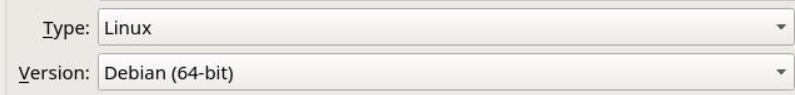
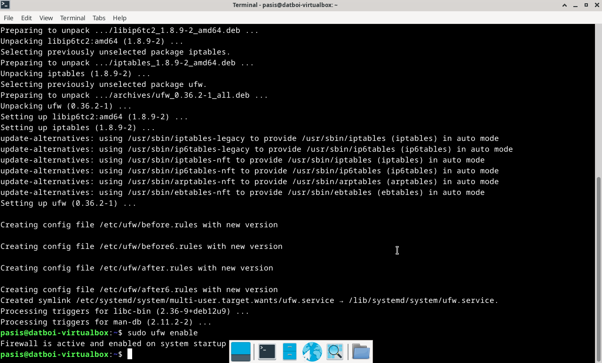

# Linuxin asennus virtuaalikoneelle, tähän alle specsejä.

- Tietokoneen specsit: AMD Ryzen 7 5700X3D prosessori, RTX 4070 Super näytönohjain, 32gb RAM sekä B550M emolevy, 1TB SSD sekä Windows 11 Home OS.
- Asennetaan Debian-live-12.9.0-amd64-xfce versio
- RAM-allokointi virtuaalikoneelle: 8GB
- virtuaaliselle kovalevylle tilaa jaettu: 150GB
- VirtualBox käytössä
  
## pieni ongelma minkä kohtasin

Kun tein ton virtuaalikoneen ekaa kertaa VirtualBoxissa ja boottasin sen siinä live-modessa, niin mulle tuli viesti: "kernel requires an x86-64 cpu, but only detected an i686 cpu. unable to boot - please use a kernel appropriate for your cpu".
Mutta tiedän jo valmiiksi, että mun prosessori (AMD Ryzen 7 5700x3d) on x86-64 prosessori niin ajattelin, että ehkä varmaan laitoin vahingossa settingsseissä jotain väärin. Tästä syystä poistin tuon virtuaalikoneen ja tein uuden, ja uutta tehdessäni huomasin, 
kun olin antamassa sille virtuaalikoneelle nimeä niin kirjoitin: PasiSalmelaLinuxVM, ja kun kirjoitin tuon sanan Linux siihen, se vaihtoi "Version:" kohdan automaattisesti Linuxiin. 

Tämän jälkeen poistin sanan Linux virtuaalikoneeni nimestä, ja vaihdoin version takaisin debianiksi valikosta
ja boottasin uudestaan live modessa ja nyt toimi ongelmitta

## Testataan toimiiko

Asensin debianin desktopilla olleesta Debian installerista, ja "https://terokarvinen.com/2021/install-debian-on-virtualbox/?fromSearch=debian#first-login" -ohjeita noudattaen laitoin asetukset valmiiksi ja installerin lopussa olevan reboottauksen jälkeen kirjauduin sisään laittamillani tunnuksilla ja testasin web browserilla, että youtube toimii. Kaikki siis kunnossa. Asensin myös Teron ohjeiden mukaan palomuurin $ sudo apt-get -y install ufw komennolla sekä laitoin sen päälle $ sudo ufw enable komennolla. 

## Lähteet
- https://www.debian.org/CD/live/     (latasin debian ISO tiedoston täältä)
