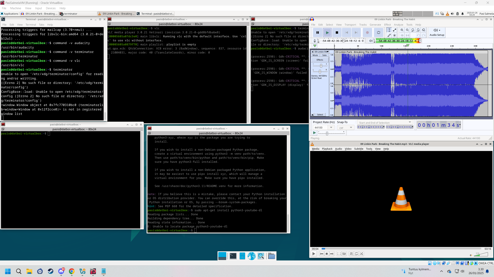

Pohjana Tero Karvinen 2025: Linux kurssi, http://terokarvinen.com

# Host-koneen specsit:

- Tietokoneen specsit: AMD Ryzen 7 5700X3D prosessori, RTX 4070 Super näytönohjain (12GB VRAM), 32GB RAM sekä B550M emolevy, 1TB SSD sekä Windows 11 Home OS.
- käytössä Debian-live-12.9.0-amd64-xfce versio
- RAM-allokointi virtuaalikoneelle: 8GB
- virtuaaliselle kovalevylle tilaa jaettu: 150GB
- VirtualBox-ohjelma käytössä

# h2 x) tehtävä

-Tero on tehnyt sivun, johon hän on koonnut kaikista tärkeimmät Linux-komennot, jotka ovat olleet käytössä jo ennen internettiä. Se, että ne ovat vieläkin käytössä on todiste siitä, että ne on suunniteltu erittäin hyvin koska melkein kaikki tech-alalla oleva muuttuu jopa muutamissa vuosissa huomattavasti, puhumattakaan kymmenistä vuosista. Henkilökohtaisesti yllätyin, kuinka yksinkertaisilta nuo Linuxin file directoryt näyttävät Windowssiin verrattuna. Windowssissa joudut melkein aina googlaamaan, missä tietyt syvällä olevat tiedostot sijaitsevat directoryssä (ja missä directoryssä), koska niitä on mahdotonta muistaa jos koneella on enemmän ohjelmia asennettuna. 

# a) ja b) tehtävät: Micron, VLC:n, Terminator:in sekä Audacity:n asentaminen + testaus

a) Asensin Micro-tekstieditorin jo viime tunnin aikana komennolla "sudo apt install micro".

b) "https://terokarvinen.com/2020/command-line-basics-revisited/?fromSearch=command%20line%20basics%20revisited" aivan viimeisellä rivillä mainitaan, että voit asentaa monta eri ohjelmaa käyttämällä komentoa $ sudo apt-get -y install x y z ------xyz korvataan toki ohjelmien nimillä. Itse asensin VLC:n, mikä on ilmainen open-source multimedia playeri, jolla voi katsoa melkein minkä tahansa formaatin videoita. Esim windowssin oletus media player ei välillä suostu tiettyjä video codecceja avaamaan, ja tällöin varmaan helpointa on vaan avata se VLC:llä. Toinen ohjelma minkä asensin on "Terminator". Se on Linuxille tarkoitettu Terminal-emulator, jonka avulla voit pitää useaa terminaalia auki samanaikaisesti, ja vaikka tehdä custom keybindit, millä pystyt vaihtamaan suoraan yhdestä terminaali-ikkunasta toiseen. (kuva alempana) Kolmas ohjelma minkä asensin oli Audacity, joka on hyvin tunnettu audio-editori. Asensin nämä kaikki 3 samaan aikaan siis komennolla "sudo apt-get install vlc terminator audacity" ---Testasin myös, ja kaikki 3 ohjelmaa toimii kuten pitääkin.

Latasin myös tuon python packet managerin (pip3) ja koitin ladata alkuun "https://steemit.com/linux/@netscape101/download-music-to-mp3-with-the-command-line-in-linux" -ohjeiden mukaan sellaisen ohjelman kuin youtube-dl (joka periaatteessa vaan lataa youtubesta URL:n avulla videon ja converttaa sen .mp3 tiedostoksi, jota voi sitten kuunnella lokaalisti koneelta, mutta jostain syystä tuo komento "sudo pip3 install youtube-dl" ei onnistunut, ja ongelma vaikutti sen verran monimutkaselta varsinkin tälläisen aloittelevan Linux-käyttäjän silmään, että päätin vaan ottaa easy-routen ja käyttää netissä olevaa YT URL to mp3 file converteria, jossa kesti alle minuutti. 

# c) tehtävä

kuten "https://terokarvinen.com/2020/command-line-basics-revisited/?fromSearch=command%20line%20basics%20revisited" -sivulla mainitaan, Linuxissa ei ole erillisiä levyjä kuten windowssissa esim C:// D:// jne, vaan kaikki asennetaan rootin alle. Sinun tarvitsee muistaa vain muutamat tärkeät directoryt, jotka ovat: / ---tämä on Root, eli kaikista ylin directory, minkä alle kaikki muu asentuu. Sitten sen alapuolella on /home, johon tallentuu kaikki eri käyttäjät esim omassa tapuksessani /home/pasis/. Toinen tärkeä on /etc/, täältä löytyy kaikki järjestelmän asetukset luettavissa tekstitiedostoissa. Neljäs tärkeä directory on /media/, se on tarkoitettu esim ulkoisille muistitikuille. Eli jos tökkäät USB-muistitikun niin se tallentaa sen /media/ directoryyn. (lähde: https://www.howtogeek.com/117435/htg-explains-the-linux-directory-structure-explained/#:~:text=The%20%2Fmedia%20directory%20contains%20subdirectories,the%20CD%20inside%20this%20directory.)  
Ja vielä yksi tärkeä hakemisto on /var/log/, joka sisältää järjestelmän erilaisia logeja, joita voi katsella.

# Lähteet
https://terokarvinen.com/2020/command-line-basics-revisited/?fromSearch=command%20line%20basics%20revisited
https://dev.to/xeroxism/how-to-install-terminator-a-linux-terminal-emulator-on-steroids-1m3h   (täältä löysin Terminator-ohjelman)
https://steemit.com/linux/@netscape101/download-music-to-mp3-with-the-command-line-in-linux  
https://www.howtogeek.com/117435/htg-explains-the-linux-directory-structure-explained/#:~:text=The%20%2Fmedia%20directory%20contains%20subdirectories,the%20CD%20inside%20this%20directory.  
