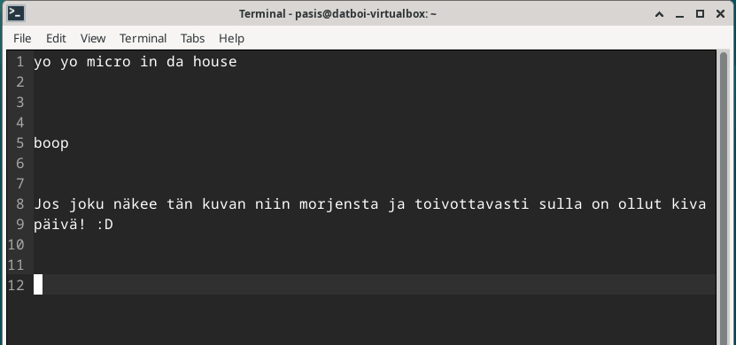

Pohjana Tero Karvinen 2025: Linux kurssi, http://terokarvinen.com

# h2 x) tehtävä

-Tero on tehnyt sivun, johon hän on koonnut kaikista tärkeimmät Linux-komennot, jotka ovat olleet käytössä jo ennen internettiä. Se, että ne ovat vieläkin käytössä on todiste siitä, että ne on suunniteltu erittäin hyvin koska melkein kaikki tech-alalla oleva muuttuu jopa muutamissa vuosissa huomattavasti, puhumattakaan kymmenistä vuosista. Henkilökohtaisesti yllätyin, kuinka yksinkertaisilta nuo Linuxin file directoryt näyttävät Windowssiin verrattuna. Windowssissa joudut melkein aina googlaamaan, missä tietyt syvällä olevat tiedostot sijaitsevat directoryssä (ja missä directoryssä), koska niitä on mahdotonta muistaa jos koneella on enemmän ohjelmia asennettuna. 

# a) ja b) tehtävät (micron + muiden ohjelmien asentaminen)

a) Asensin Micro tekstieditorin jo viime tunnin aikana komennolla "sudo apt install micro".

b) "https://terokarvinen.com/2020/command-line-basics-revisited/?fromSearch=command%20line%20basics%20revisited" aivan viimeisellä rivillä mainitaan, että voit asentaa monta eri ohjelmaa käyttämällä komentoa $ sudo apt-get -y install x y z ------xyz korvataan toki ohjelmien nimillä. Itse asensin VLC:n, mikä on ilmainen open-source multimedia playeri, jolla voi katsoa melkein minkä tahansa formaatin videoita. Esim windowssin oletus media player ei välillä suostu tiettyjä video codecceja avaamaan, ja tällöin varmaan helpointa on vaan avata se VLC:llä. Toinen ohjelma minkä asensin on "Terminator". Se on Linuxille tarkoitettu Terminal-emulator, Sen avulla voit pitää useaa terminaalia auki samanaikaisesti, ja vaikka tehdä custom keybindit, millä pystyt vaihtamaan suoraan yhdestä terminaali-ikkunasta toiseen. (kuva alempana) Kolmas ohjelma minkä asensin oli Audacity, joka on hyvin tunnettu audio-editori. Asensin nämä kaikki 3 samaan aikaan siis komennolla "sudo apt-get install vlc terminator audacity"

(LISÄÄ KUVA VLC:stä, Terminatorista sekä vikasta softasta KÄYTÖS TÄHÄN)

# Lähteet
https://terokarvinen.com/2020/command-line-basics-revisited/?fromSearch=command%20line%20basics%20revisited
https://dev.to/xeroxism/how-to-install-terminator-a-linux-terminal-emulator-on-steroids-1m3h   (täältä löysin Terminator-ohjelman)
