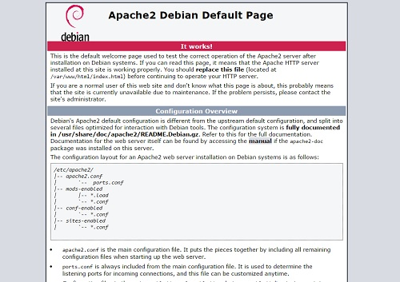
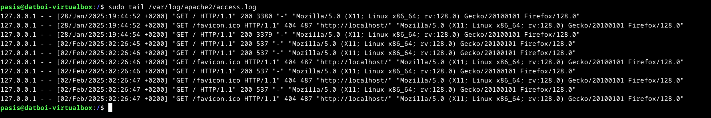
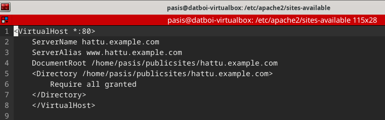
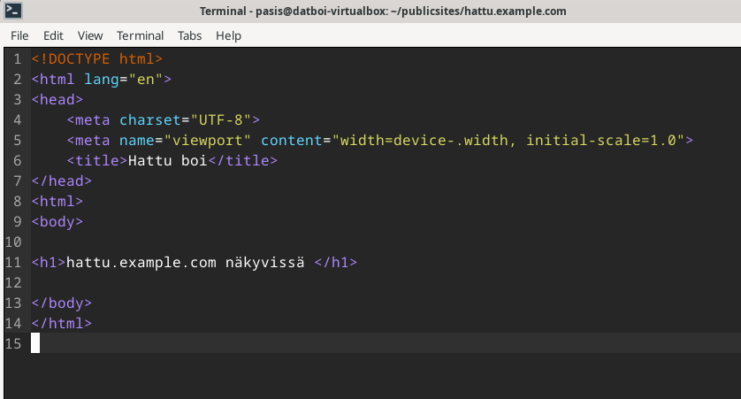
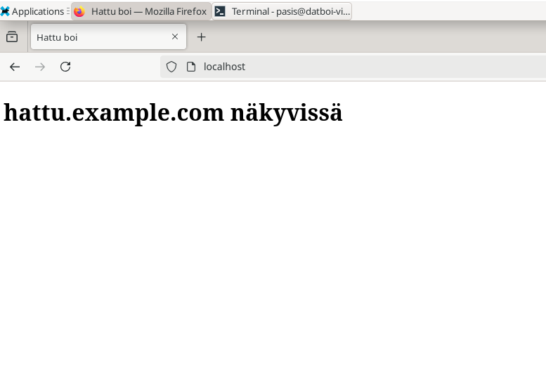
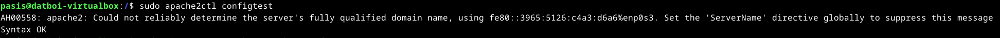
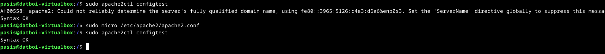
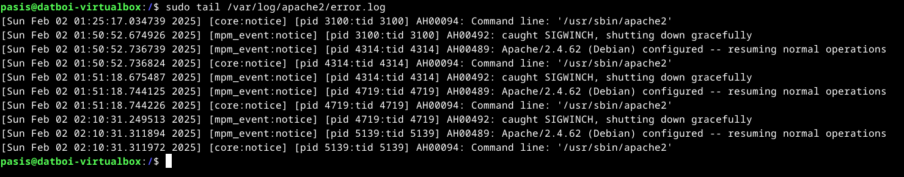

Pohjana Tero Karvinen 2025: Linux kurssi, http://terokarvinen.com

# Host-koneen specsit:

- Tietokoneen specsit: AMD Ryzen 7 5700X3D prosessori, RTX 4070 Super näytönohjain (12GB VRAM), 32GB RAM sekä B550M emolevy, 1TB SSD sekä Windows 11 Home OS.
- käytössä Debian-live-12.9.0-amd64-xfce versio
- RAM-allokointi virtuaalikoneelle: 8GB
- virtuaaliselle kovalevylle tilaa jaettu: 150GB
- VirtualBox-ohjelma käytössä

# x) tehtävä

-Nimipohjaiset virtuaalipalvelimet eroavat IP-pohjaisista virtuaalipalvelimista siten, että yhdellä IP-osoitteella voit hostata useampaakin verkkosivustoa, kun taas IP-pohjaisilla virtuaalipalvelimilla jokainen vaatii oman IP-osoitteen. Tämä vaatii joitain erillisiä DNS-konfiguraatioita toimiakseen.

# a) Tehtävä 

Asennettiin tuo Apache jo tunnin aikana komennolla $ sudo apt-get -y install apache2, ja menemällä browserissa http://localhost sain näkyviin sen default sivun, mikä näkyy kun Apache on onnistuneesti asennettuna, mutta alettiin jo tunnilla tekemään tuota name-based virtual hostia niin en saa nyt kuvaa siitä, mutta tälläinen sivu oli: (kuva: Stackoverflow:n sivulta) --elikkä asennus onnistui.

# b) tehtävä - lokit

tuo "GET / HTTP/1.1" 200 Meinaa, että HTTP GET requesti tehtiin sivulle, (sivu ladattiin), ja tuo numero 200 meinaa, että se oli onnistunut. (Lähde: https://askubuntu.com/questions/733265/what-is-get-http-1-1-200-19019) sen jälkeen oleva Mozzilla/5.0 kertoo browserin ja sen version. Seuraavaksi on X11; Linux x86_64. Tuo X11 on versio 11 X window systemistä, ja se on pala softaa joka kommunikoi todella alhaisella tasolla koneen video hardwaren kanssa ja näyttää ruudulla pikseleitä (tai näin ainakin itse ymmärsin sen)" ----- "X Window System is that piece of software which talks to your video hardware and displays bitmapped graphics on your monitor. It underlies your UNIX/Linux desktop environment (e.g. GNOME, KDE, Xfce, etc.) and graphical applications, all of which talk to X at a very low level in order to display graphics on the screen." (lähde: https://unix.stackexchange.com/questions/63550/x11-platform-in-google-account-activity)  Linux x86_64 on käyttöjärjestelmä, jolta requesti tuli.  

# c) ja e) tehtävä  --Name-based virtual hosting + valid html5 page

Aloitin menemällä /etc/apache2/sites-enabled ja käytin komentoa $ sudo a2dissite 000-default.conf, jolla otin sen default localhost sivun pois käytöstä ja tein sinne uuden tiedoston nimeltä hattu.example.com.conf. Sen jälkeen laitoin kyseisen tiedoston sisälle seuraavat tiedot:

Sen jälkeen komennolla $ sudo a2ensite hattu.example.com ja restarttia komennolla sudo systemctl restart apache2 ja tämän jälkeen kävin katsomas /etc/apache2/sites-enabled hakemistosta, että onko hattu.example.com.conf mennyt sinne niin sieltähän se löytyi. Seuraavaksi käyn tekemässä /home/pasis/publicsites hakemistoon tuon hattu.example.com hakemiston, ja sen sisälle index.html tiedoston (lähde: https://terokarvinen.com/2018/04/10/name-based-virtual-hosts-on-apache-multiple-websites-to-single-ip-address/)

Sen jälkeen kävin netistä vaan googlaamalla default html page template, ja pastesin koodin sinne index.html tiedoston sisälle niin siitä saatiin tuo validi html5 sivu.

ja localhostiin menemällä browserissa näyttää nyt tältä

## Pieni error, minkä kohtasin

Elikkäs kun koitin alkaa tehdä tuota b) tehtävää (teen sen vasta noiden c) ja e) tehtävien jälkeen niin kun koitin saada noita lokitietoja näkyviin niin jostain syystä /var/log/apache2/access.logiin ei ilmestynyt yhtään uusia lokeja, vaikka shift-reloadilla koitin päivittää sekä localhost, että hattu.example.com sivua browserissa. Tämän jälkeen katsoin komennolla $ sudo apache2ctl configtest, jos löytyisi jotain mikä voisi selittää asian ja sinne ilmestyi tälläinen viesti

Tämän jälkeen googlasin kyseisen errorin, joka johti minut suoraan (https://www.digitalocean.com/community/tutorials/apache-configuration-error-ah00558-could-not-reliably-determine-the-server-s-fully-qualified-domain-name) -sivulle, josta löytyikin ohjeet, millä sain tuon errorin korjattua. Ohjeissa luki, että täytyy mennä /etc/apache2/apache2.conf tiedostoon ja tiedoston loppuun lisätä "ServerName 127.0.0.1" joten kävin tekemässä ton, ja sitten komennolla $ sudo apache2ctl configtest kyseinen error-viesti ei tullut enään näkyviin. 

Jostain syystä en silti saa access.logiin mitään uusia lokeja, vaikka shift-reloadilla reloadaan localhost sivua. error.logiin on tullut tälläistä näkyviin 

Googlasin tuon AH00492 errorin ja siellä sanottiin, että tuo AH00492 shutting down gracefully viesti tulee kun restarttaa tuon apache2 palvelimen. ----------Jostain syystä (en osaa sanoa miksi) niin nyt alkoi tulemaan access.logiin tietoja kun reloadasin sivua. Eli vissiin viimeisimmän apache2 restartin jälkeen alkoi toimia. 

# Lähteet

https://terokarvinen.com/2018/04/10/name-based-virtual-hosts-on-apache-multiple-websites-to-single-ip-address/  
https://httpd.apache.org/docs/2.4/vhosts/name-based.html  
https://www.digitalocean.com/community/tutorials/apache-configuration-error-ah00558-could-not-reliably-determine-the-server-s-fully-qualified-domain-name  
https://askubuntu.com/questions/733265/what-is-get-http-1-1-200-19019  
