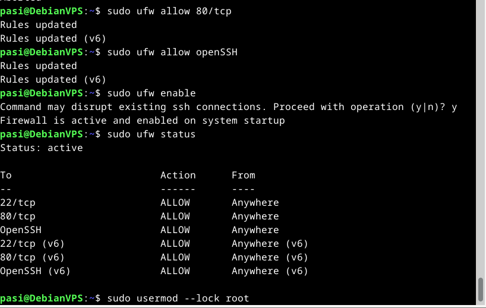
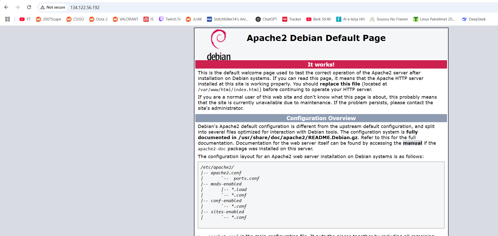
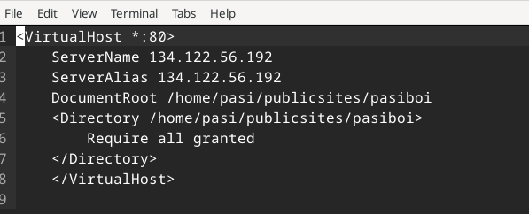
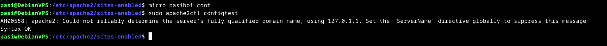
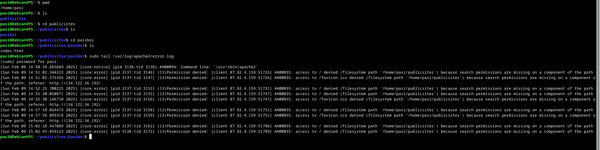
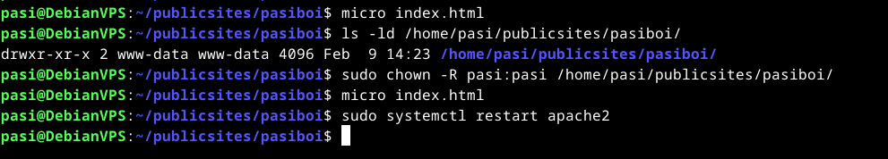
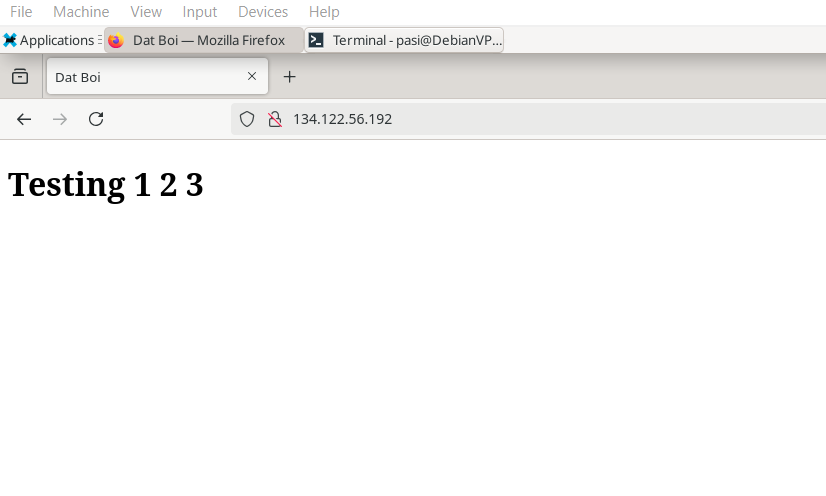

Pohjana Tero Karvinen 2025: Linux kurssi, http://terokarvinen.com

# Host-koneen specsit:

- Tietokoneen specsit: AMD Ryzen 7 5700X3D prosessori, RTX 4070 Super näytönohjain (12GB VRAM), 32GB RAM, B550M emolevy, 1TB SSD sekä Windows 11 Home OS.
- käytössä Debian-live-12.9.0-amd64-xfce versio
- RAM-allokointi virtuaalikoneelle: 8GB
- virtuaaliselle kovalevylle tilaa jaettu: 150GB
- VirtualBox-ohjelma käytössä

# x) tehtävä

a) Susanna Lehto hyödyntää Github Education pakettia, ja tästä syystä vuokraa DigitalOceanista Virtual Private Serverin. Hän on lisännyt kuvia prosessin aikana, joissa kertoo mitä asetuksia hän valitsee (Datakeskus mahd. läheltä sijaintia, storagen määrä ynms). Tämän jälkeen hän näyttää vielä miten domain nimi vuokrataan namecheapin kautta, myös käyttäen github educationin alennuskoodia.

d) Hän ottaa ekaksi SSH-yhteyden juuri vuokraamansa virtuaalipalvelimen IP-osoitteeseen, ja sen jälkeen lataa sekä asentaa ufw-palomuurin ja avaa tarvittavat portit, jolloinka muutamalla komennolla saadaan mahdollisten hyökkääjien työtä vaikeutettua huomattavasti (Lähde: Tero Karvisen luento sekä https://susannalehto.fi/2022/teoriasta-kaytantoon-pilvipalvelimen-avulla-h4/) --Seuraavassa kohdassa hän jo huomaa, että joku kiinalainen botti oli yrittänyt päästä käsiksi hänen juuri vuokraamaansa virtuaalipalvelimeen, mutta vahvan salasanan sekä palomuurin takia tämä jäi vain yritykseksi. 

e) Seuraavaksi Susanna asentaa apache web-palvelimen sekä korvaa sen default-etusivun tekemällä uuden perus html-sivun.

f) Susanna asentaa uusimmat päivitykset virtuaalipalvelimelleen

# a) tehtävä - Virtuaalipalvelimen vuokraus (DigitalOcean)

Aloitin rekisteröitymällä DigitalOcean.com -sivulle, ja sen jälkeen linkitin GitHub-education accountin tuohon DigitalOcean accounttiin, jonka jälkeen sain viestin, että 200$ arvosta credittejä on annettu käyttöön seuraavan vuoden ajaksi. 
Sen jälkeen menin kohtaan Droplets (jostain syystä VPS on nimellä droplets-tällä sivustolla) ja lähdin valitsemaan minkälaisen virtuaaliserverin haluan vuokrata, ja tottakai tälleen ensikertalaisena ja testaamiskäyttöön valitsin halvimman, joka on 6$/kk tällä hetkellä. 

Seuraavaksi sain valita kirjautumisen ssh-avaimella tai salasanalla, ja kuten tunnilla näytettiin, asensin ensiksi $ sudo apt-get install openssh-client ja sen jälkeen komennolla $ ssh-keygen loin itselleni ssh-avaimen ja tämän jälkeen kyseinen public-key pitää copy pastee /home/pasis/.ssh/id_rsa.pub tiedostosta tuonne digitaloceanin sivulle.

Lopuksi annoin tunnistettavan host-nimen sille, ja sen jälkeen create droplet, ja kesti alle minuutti, että sain IP-osoitteen näkyviin. 

# b) tehtävä - Alkutoimet + Palomuuri + Root-tunnuksen sulkeminen + ohjelmien päivitys   

Ensiksi otin yhteyden virtuaalipalvelimeeni komennolla $ ssh root@134.122.56.192 ja sen jälkeen tein uuden käyttäjän komennolla $ sudo adduser pasi, ja lisäsin tuon käyttäjän sudo-ryhmään komennolla $ sudo adduser pasi sudo. Sitten root# sudo cp -rvn /root/.ssh/ /home/pasi/ sekä 
root# sudo chown -R pasi:pasi /home/pasi/ komennoilla kopioin root:in ssh-asetukset, jotta pääsen kirjautumaan tuolla uudella omalla käyttäjällä sisään. (lähde: https://terokarvinen.com/linux-palvelimet/  ---kohta h4)
 
 
Tämän jälkeen exit-rootilta ja kirjauduin ssh pasi@134.122.56.192 sisään, jonka jälkeen sudo apt-get update; sudo apt-get dist-upgrade; sudo systemctl reboot -komennoilla viimeisimmät päivitykset voimaan ja tämän jälkeen palomuurin asennus, ja porttien avaaminen komennoilla sudo ufw allow 22/tcp, sudo ufw allow 80/tcp, sudo ufw allow openSSH ja tämän jälkeen sudo ufw enable. (Lähde https://terokarvinen.com/linux-palvelimet/  sekä https://www.digitalocean.com/community/tutorials/ufw-essentials-common-firewall-rules-and-commands)  
 
Disclaimer: En oo varma tarviiko tota sudo ufw allow openSSH-komentoa, jota digitaloceanin sivustolla käytettiin, vai riittääkö vaan tuo porttien 22 ja 80 avaaminen)
 
 
Seuraavaksi Rootin sulkeminen komennolla $ sudo usermod --lock root 

#  c) tehtävä - Apachen asennus + default-sivun korvaaminen uudella     -------Tuli ongelmia, TLDR: löytyy seuraavan kappaleen lopusta!---------

Seuraavaksi asennetaan apache2 komennolla $ sudo apt install apache2, ja tämän jälkeen laitetaan se päälle $ sudo systemctl enable apache2

Sitten menin /etc/apache2/sites-availableen ja tein uuden .conf tiedoston jonka sisälle 
 

 
Sitten sudo a2ensite pasiboi.conf ja menin /sites-enabled hakemistoon, jossa sudo a2dissite 000-default.conf  
Tämän jälkeen kävin tekemässä /home/pasi/publicsites/pasiboi/index.html tiedostopolun sekä tuon index.html tiedoston, jonka sisälle heitin vaan sellasen default HTML5 templaten

Taas kävi sama ongelma, kuin viime viikon tehtävissä eli error AH00558, Kun käytin komentoa sudo apache2ctl configtest

 
Viime viikon tehtävissä ratkaisin tämän digitaloceanin sivuilta löytyvien ohjeiden avulla menemällä /etc/apache2/apache2.conf tiedostoon ja lisäämällä ihan vikalle riville ServerName 127.0.0.1, mutta nyt käyn lisäämässä sinne ServerName 134.122.56.192, koska meillä on vuokrattuna tuo virtuaalipalvelin ja saatiin public ipv4-osoite.
 
tämän jälkeen tuo AH00558 error lähti pois kun käytin sudo apache2ctl configtestiä, mutta jostain syystä 134.122.56.192 ei silti vastaa
 

 
Elikkäs access to root denied errori tuli, kokeilin ettii netistä tietoo, mut en löytäny vastausta ongelmaan, koitin myös poistaa 000-default.conf tiedoston sisällä olevat tiedostot, jos se jostain syystä olisi häirinnyt, mutta ei siltikään toimi --Testailen myöhemmin lisää/katsotaan tunnilla jos joillakin muilla on sama ongelma

# Jatkoa c) tehtävälle  --- Palautuksen jälkeen kommenttien neuvoja testataan (TLDR: löytyy kappaleen lopusta!)

Palautettuani tehtävän olin saanut kommentin, ja siinä huomautettiin, että olin unohtanut yhden artikkelin lukea ohjeista kokonaan, ja tämän takia myös en ollut laittanut PermitRootLogin kohtaa pois päältä. Kävin sen tekemässä komennoilla $ sudoedit /etc/ssh/sshd_config  
     
    PermitRootLogin no  
     
$ sudo service ssh restart 
 
Tämän jälkeen kun ei vieläkään toiminut, kävin error.logeissa, ja sieltä tuli sama AH00035 error kuin aikaisemmin. Kävin tämän jälkeen ja testasin muuttaa html-koodia tuolla /publicsites/pasiboi/index.html tiedostossa, ja kun yritin tallentaa muutokset niin tuli viesti: Permission denied, would u like to save using sudo? --Mutta muistan, että Tero mainitsi jollain tunnilla että /home/pasi/ directoryn sisällä ei koskaan kannata käyttää sudoa, niin pastesin tuon errorin chatGPT:hen, koska en saanut netistä löytyvistä lähteistä selkoa asiaan. Siellä neuvottiin tällä komennolla katsomaan, kuka omistaa muokkausoikeudet directoryyn.
  
 
Sitten vaihdoin muokkausoikeudet pasille, ja sain tallennettua muokatun HTML-koodin index.html tiedostoon, restarttasin apachen ja tämän jälkeen kun menin browseriin niin sain sen index.html sivun näkyviin vihdoinkin.

### C) tehtävän TLDR: Missasin ohjeissa tärkeän artikkelin, joku kommenteissa huomautti. --> Tuli ongelmia saada index.html sivu näkyviin virtuaalipalvelimen IP-osoitteella, vika johtui riittämättömistä oikeuksista pasi-käyttäjällä, tiedostot olivat oikeissa paikoissa ja oikein konfiguroitu sekä palomuurin portit oikein avattu.
 
  

# Lähteet
https://susannalehto.fi/2022/teoriasta-kaytantoon-pilvipalvelimen-avulla-h4/  
https://www.digitalocean.com/community/tutorials/ufw-essentials-common-firewall-rules-and-commands  
https://terokarvinen.com/linux-palvelimet/
