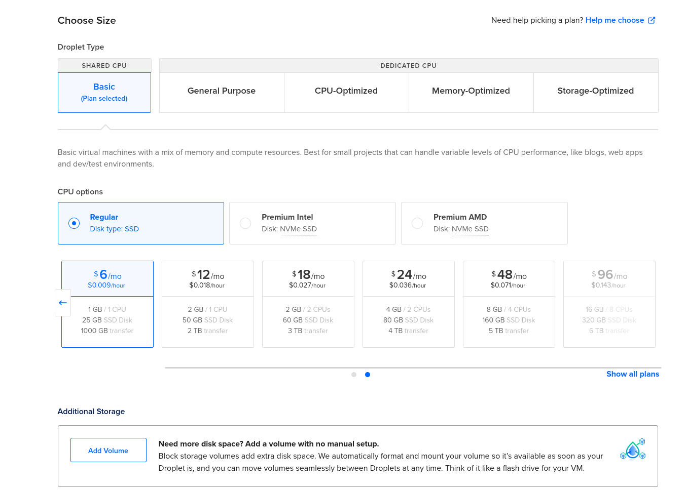
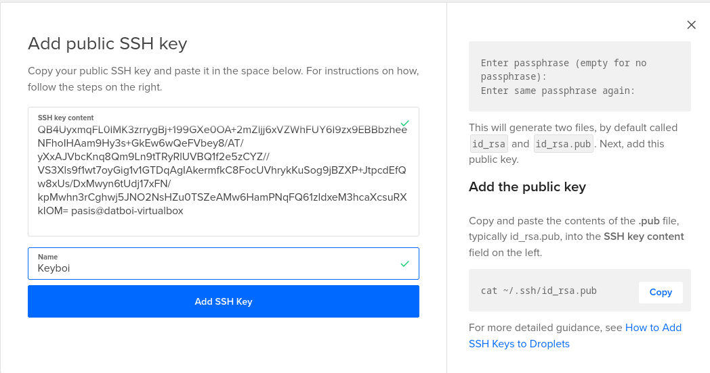
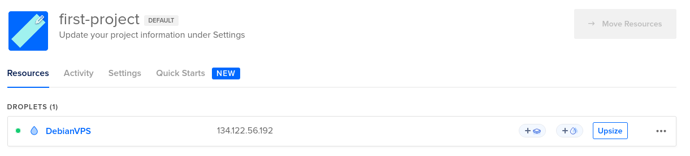

Pohjana Tero Karvinen 2025: Linux kurssi, http://terokarvinen.com

# Host-koneen specsit:

- Tietokoneen specsit: AMD Ryzen 7 5700X3D prosessori, RTX 4070 Super näytönohjain (12GB VRAM), 32GB RAM, B550M emolevy, 1TB SSD sekä Windows 11 Home OS.
- käytössä Debian-live-12.9.0-amd64-xfce versio
- RAM-allokointi virtuaalikoneelle: 8GB
- virtuaaliselle kovalevylle tilaa jaettu: 150GB
- VirtualBox-ohjelma käytössä

# x) tehtävä

a) Susanna Lehto hyödyntää Github Education pakettia, ja tästä syystä vuokraa DigitalOceanista Virtual Private Serverin. Hän on lisännyt kuvia prosessin aikana, joissa kertoo mitä asetuksia hän valitsee (Datakeskus mahd. läheltä sijaintia, storagen määrä ynms). Tämän jälkeen hän näyttää vielä miten domain nimi vuokrataan namecheapin kautta, myös käyttäen github educationin alennuskoodia.

d) Hän ottaa ekaksi SSH-yhteyden juuri vuokraamansa virtuaalipalvelimen IP-osoitteeseen, ja sen jälkeen lataa sekä asentaa ufw-palomuurin ja avaa tarvittavat portit, jolloinka muutamalla komennolla saadaan mahdollisten hyökkääjien työtä vaikeutettua huomattavasti (Lähde: Tero Karvisen luento sekä https://susannalehto.fi/2022/teoriasta-kaytantoon-pilvipalvelimen-avulla-h4/) --Seuraavassa kohdassa hän jo huomaa, että joku kiinalainen botti oli yrittänyt päästä käsiksi hänen juuri vuokraamaansa virtuaalipalvelimeen, mutta vahvan salasanan sekä palomuurin takia tämä jäi vain yritykseksi. 

e) Seuraavaksi Susanna asentaa apache web-palvelimen sekä korvaa sen default-etusivun tekemällä uuden perus html-sivun.

f) Susanna asentaa uusimmat päivitykset virtuaalipalvelimelleen

# a) tehtävä - Virtuaalipalvelimen vuokraus (DigitalOcean)

Aloitin rekisteröitymällä DigitalOcean.com -sivulle, ja sen jälkeen linkitin GitHub-education accountin tuohon DigitalOcean accounttiin, jonka jälkeen sain viestin, että 200$ arvosta credittejä on annettu käyttöön seuraavan vuoden ajaksi. 
Sen jälkeen menin kohtaan Droplets (jostain syystä VPS on nimellä droplets-tällä sivustolla) ja lähdin valitsemaan minkälaisen virtuaaliserverin haluan vuokrata, ja tottakai tälleen ensikertalaisena ja testaamiskäyttöön valitsin halvimman, joka on 6$/kk tällä hetkellä. 

Seuraavaksi sain valita kirjautumisen ssh-avaimella tai salasanalla, ja kuten tunnilla näytettiin, asensin ensiksi $ sudo apt-get install openssh-client ja sen jälkeen komennolla $ ssh-keygen loin itselleni ssh-avaimen ja tämän jälkeen kyseinen public-key pitää copy pastee /home/pasis/.ssh/id_rsa.pub tiedostosta tuonne digitaloceanin sivulle.

Lopuksi annoin tunnistettavan host-nimen sille, ja sen jälkeen create droplet, ja kesti alle minuutti, että sain IP-osoitteen näkyviin. 

# b) tehtävä - Alkutoimet + Palomuuri + Root-tunnuksen sulkeminen + ohjelmien päivitys

Ensiksi otin yhteyden virtuaalipalvelimeeni komennolla $ ssh root@134.122.56.192 ja sen jälkeen tein uuden käyttäjän komennolla $ sudo adduser pasi, ja lisäsin tuon käyttäjän sudo-ryhmään komennolla $ sudo adduser pasi sudo. Sitten root# sudo cp -rvn /root/.ssh/ /home/pasi/ sekä 
root# sudo chown -R pasi:pasi /home/pasi/ komennoilla kopioin root:in ssh-asetukset, jotta pääsen kirjautumaan tuolla uudella omalla käyttäjällä sisään. (lähde: https://terokarvinen.com/linux-palvelimet/  ---kohta h4)
 
 
 
Tämän jälkeen exit-rootilta ja kirjauduin ssh pasi@134.122.56.192 sisään, jonka jälkeen sudo apt-get update; sudo apt-get dist-upgrade; sudo systemctl reboot -komennoilla viimeisimmät päivitykset voimaan ja tämän jälkeen palomuurin asennus, ja porttien avaaminen komennoilla sudo ufw allow 22/tcp, sudo ufw allow 80/tcp, ja tämän jälkeen sudo ufw enable

# Lähteet
https://susannalehto.fi/2022/teoriasta-kaytantoon-pilvipalvelimen-avulla-h4/  
https://www.digitalocean.com/community/tutorials/ufw-essentials-common-firewall-rules-and-commands
https://terokarvinen.com/linux-palvelimet/
