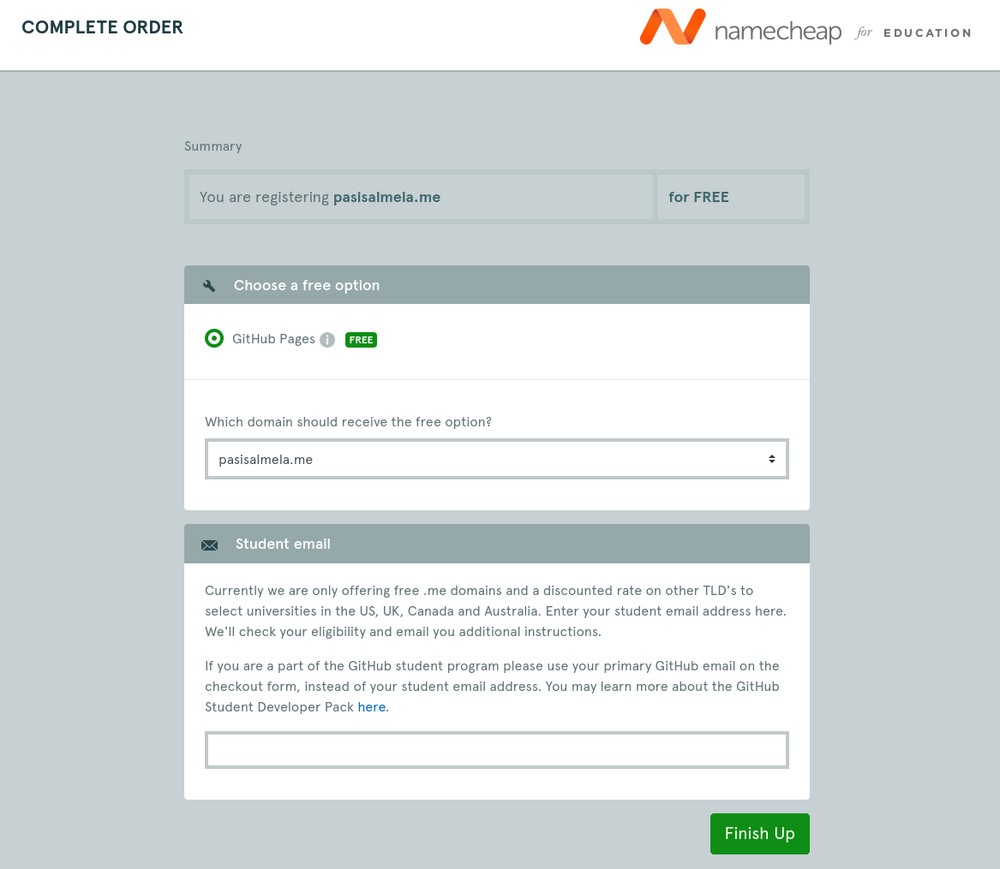

Pohjana Tero Karvinen 2025: Linux kurssi, http://terokarvinen.com

# Host-koneen specsit:

- Tietokoneen specsit: AMD Ryzen 7 5700X3D prosessori, RTX 4070 Super näytönohjain (12GB VRAM), 32GB RAM, B550M emolevy, 1TB SSD sekä Windows 11 Home OS.
- käytössä Debian-live-12.9.0-amd64-xfce versio
- RAM-allokointi virtuaalikoneelle: 8GB
- virtuaaliselle kovalevylle tilaa jaettu: 150GB
- VirtualBox-ohjelma käytössä

# a) Tehtävä - Domainin vuokraaminen (Namecheap)

Näköjään Namecheap ei ainakaan toimi Github educationin kanssa (Your university is not eligible) joten aloitin laittamalla oman nimeni Namecheapin domain searchiin ja sieltä tuli monta eri vaihtoehtoa, joista päätin valita pasisalmela.pro🥈
 

