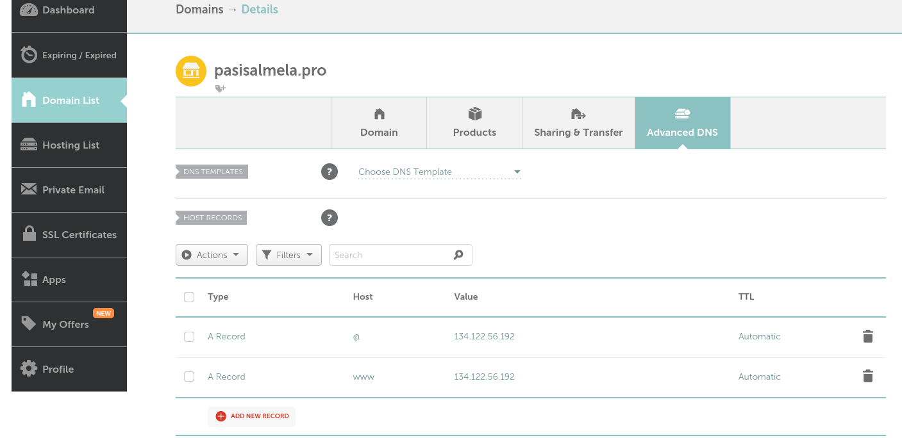

Pohjana Tero Karvinen 2025: Linux kurssi, http://terokarvinen.com

# Host-koneen specsit:

- Tietokoneen specsit: AMD Ryzen 7 5700X3D prosessori, RTX 4070 Super näytönohjain (12GB VRAM), 32GB RAM, B550M emolevy, 1TB SSD sekä Windows 11 Home OS.
- käytössä Debian-live-12.9.0-amd64-xfce versio
- RAM-allokointi virtuaalikoneelle: 8GB
- virtuaaliselle kovalevylle tilaa jaettu: 150GB
- VirtualBox-ohjelma käytössä

# a) Tehtävä - Domainin vuokraaminen (Namecheap)

Näköjään Namecheap ei ainakaan toimi Github educationin kanssa (Your university is not eligible) joten aloitin laittamalla oman nimeni Namecheapin domain searchiin ja sieltä tuli monta eri vaihtoehtoa, joista päätin valita pasisalmela.pro:n
 

 
 
Seuraavaksi menin Advanced DNS asetuksiin, ja laitoin samat asetukset mitä tunnilla käytiin läpi osoittamaan domain nimeni (pasisalmela.pro):n tuohon virtuaalipalvelimeni IP-osoitteelle 134.122.56.192. 

Tämän jälkeen kävin katsomassa whatsmydns.net -sivulta, että onnistuiko tämä ja sinne alkoi pikkuhiljaa tulla eri servereille näkyviin tuo. 
 
 

 
 
Seuraavaksi kävin kokeilemassa pasisalmela.pro koneeni selaimella, ja sieltä tuli se viime tunnilla tehty testisivu näkyviin.

 
 

# b ja c) tehtävät (Name based virtual host ja kotisivut)

Olin jo aikasemmalla kurssilla käyttänyt hyvän tovin aikaa kotisivujen tekemiseen, joten en viittinyt alkaa väsäämään uusiksi tyhjästä noita sivuja vaan kopioin tuolta mun githubista index.html, portfolio.html, services.html sekä styles.css tiedostot ja kävin tekemässä ne tiedostot tuonne /home/pasi/publicsites/pasiboi hakemistoon ja pastesin koodit niiden sisälle.  
 

