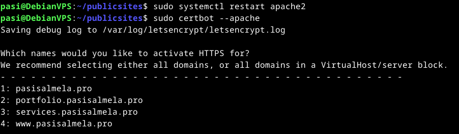
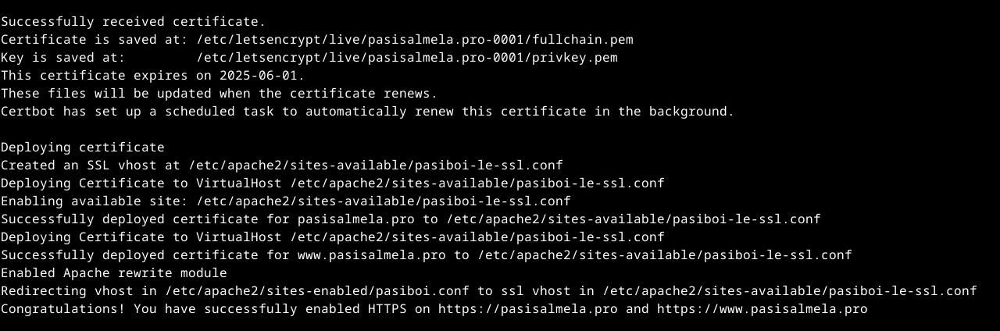

Pohjana Tero Karvinen 2025: Linux kurssi, http://terokarvinen.com

# Host-koneen specsit:

- Tietokoneen specsit: AMD Ryzen 7 5700X3D prosessori, RTX 4070 Super näytönohjain (12GB VRAM), 32GB RAM, B550M emolevy, 1TB SSD sekä Windows 11 Home OS.
- käytössä Debian-live-12.9.0-amd64-xfce versio
- RAM-allokointi virtuaalikoneelle: 8GB
- virtuaaliselle kovalevylle tilaa jaettu: 150GB
- VirtualBox-ohjelma käytössä

# x) tehtävä

1) Lets Encrypti toimii siten, että se automatisoi koko prosessin, jossa halutaan sertifikaatti omalle domainille, ja täten HTTP:// muuttuu selaimessa HTTPS://:ksi, ja yläreunassa ei näy käyttäjille mitään varoitusta esim: "TÄMÄ SIVUSTO EI OLE TURVALLINEN"  
Se vahvistaa, että käyttäjällä todellakin on kyseinen käyttäjän ilmoittama domaini, antamalla sille tietyn tehtävän mitä ei ole mahdollista suorittaa ilman, että hänellä on mahdollisuus muokata kyseisen domainin tiedostoja.
 
2) Tässä kuvaillaan, miten tuo lego-työkalu toimii tuon sertifikaatin hankkimisessa. Elikkä siinä näkyy mihin tuo lego-softa kirjoittaa/lisää tuon ACME tokenin sisältämän avaimen.
 
 
3) Tässä näkyy mitkä on pakollista olla SSL-konfiguraatiossa.
 

# a) tehtävä - Sertifikaatin hankkiminen

Aloitin lataamalla Cerbotin ja tuon scriptin komennolla sudo apt-get install certbot python-certbot-apache apache2, koska Apachen kanssa tuon prosessin voi automatisoida certbotilla. Käytin ohjeita lähteestä: https://upcloud.com/resources/tutorials/install-lets-encrypt-apache  --- Sen jälkeen komento sudo certbot --apache, jonka jälkeen se kysyy muutamia kysymyksiä mm. sähköpostiosoitteesi, mitkä domainit haluat certifioda sekä haluatko jakaa spostisi cerbotin tekijöiden kanssa jne. Vastasin näihin kysymyksiin ja scripti teki sen jälkeen loput 

# Lähteet

