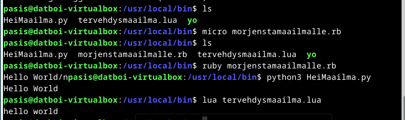
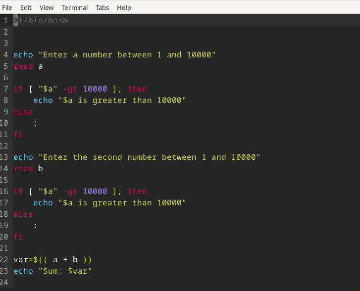
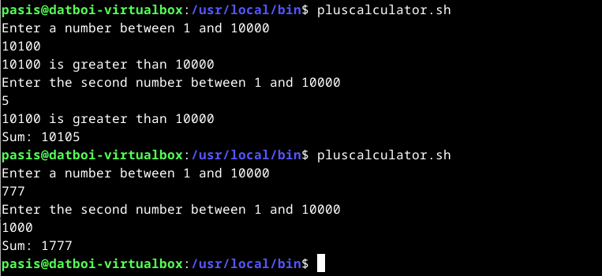

Pohjana Tero Karvinen 2025: Linux kurssi, http://terokarvinen.com

# Host-koneen specsit:

- Tietokoneen specsit: AMD Ryzen 7 5700X3D prosessori, RTX 4070 Super näytönohjain (12GB VRAM), 32GB RAM, B550M emolevy, 1TB SSD sekä Windows 11 Home OS.
- käytössä Debian-live-12.9.0-amd64-xfce versio
- RAM-allokointi virtuaalikoneelle: 8GB
- virtuaaliselle kovalevylle tilaa jaettu: 150GB
- VirtualBox-ohjelma käytössä

# a) "Hei Maailma" printtaus kolmella eri kielellä (Python, Lua, Ruby)

Ensiksi piti asentaa lua ja ruby kielet linuxille komennolla `sudo apt install lua5.3 ruby` ja tämän jälkeen menin `usr/local/bin` kansioon ja tein sinne .py .lua ja .rb tiedostot, joidenka sisälle (https://terokarvinen.com/2018/hello-python3-bash-c-c-go-lua-ruby-java-programming-languages-on-ubuntu-18-04/) -ohjeilla perus Hello World printtaukset. 

# b) Lähdeviitteet kurssin aikaisemmissa tehtävissä - TARKISTUS

Lähdeviitteet käyty läpi tehtävistä h1-h6 ja tarkistettu, että ne ovat asianmukaisesti merkitty.

# c) Uusi itse tehty shell script komento + oikeudet kaikille käyttäjille

Kävin alkuun katsomassa tälläisen artikkelin (https://www.freecodecamp.org/news/shell-scripting-crash-course-how-to-write-bash-scripts-in-linux/) ja koitin tehä hiukan modifoidun version eräästä esimerkistä mikä siellä löytyy eli ihan perus kahden numeron yhteislaskuri, mutta en halunnut kopioida vaan suoraan tuota niin ajattelin, että lisään siihen sellaisen if else lausekkeen mikä hyväksyy ainoastaan numerot 1-10000. Tältä näyttää koodi minkä tein:

Sain sen toimimaan, mutta en ihan niinkuin tarkoitin alkuunsa sillä jos laittaa numeron, joka on yli 10 000 niin se silti suorittaa toimenpiteen, mutta sanoo että numero oli yli 10 000. Pitäisi varmaan while-loopilla tehdä tuo silleen, että loopin aikana jos numero on alle 10 000 niin hyväksyy sen, mutta jos yli 10 000 niin pyytää uuden numeron kunnes syötetty numero täsmää asetettuja parametreja. Mutta ei ole niin oleellinen asia niin jätän nyt toistaseks tälläseks

Sitten piti muokata oikeudet silleen, että kaikki käyttäjät voivat käyttää tätä niin käytin siihen komentoa `sudo chmod ugo+x pluscalculator.sh`

# d) Vanha laboratorioharjoitus soveltuvin osin

Katsoin noita aikaisempia labroja vuosilta 2018-2024 ja huomasin, että ainakin 2018-2020 vuosien labroissa käytiin läpi vähän eri asioita (tietokantoja sekä Salt Minionia, joka tulee tietääkseni tutuksi Palvelinten Hallinta-kurssilla vasta nykyään) joten päätin valita https://terokarvinen.com/2024/arvioitava-laboratorioharjoitus-2024-linux-palvelimet/?fromSearch=laboratorio  --laboratorioharjoituksen, koska siinä tehtävät vaikuttavat suht.koht samoilta mitä ollaan tällä kurssillakin käyty läpi. Myös jonkin vanhan laboratorioharjoituksen ohjeissa sanottiin, että ei tarvitse kirjoittaa raporttia samalla kun tekee, ja muutenkin näistä hyvin samantyylisistä asioista ollaan jo kirjotettu raportteja tällä kurssilla niin en nyt tähän lähde uusiksi raportoimaan kaikkea, vaan keskityn olennaiseen eli kertaan noita linux-oikeuksia, name based virtual hostingia, ssh-kirjautumista sekä apachen konfigurointia. Jos tulee jotain eri ongelmia kuin mitä tähän mennessä niin lisään tähän -->

# e) Uuden tyhjän virtuaalikoneen asennus laboratorioharjoitusta varten

Tämä kohta on kirjaimellisesti sama kuin h1-tehtävä, joten muistini virkistykseksi katsoin vanhaa raporttiani (https://github.com/PasiS1337/linux-course/blob/main/h1-linux-asennus-virtuaalikoneelle.md) sekä Teron alkuperäisiä ohjeita (https://terokarvinen.com/2021/install-debian-on-virtualbox/?fromSearch=debian#first-login), mitä käytin ensimmäistä kertaa virtuaalikoneelle linuxia asentaessani.

# Lähteet

https://github.com/PasiS1337/linux-course/blob/main/h1-linux-asennus-virtuaalikoneelle.md  
https://terokarvinen.com/2021/install-debian-on-virtualbox/?fromSearch=debian#first-login  
https://terokarvinen.com/linux-palvelimet/#h7-maalisuora  
https://terokarvinen.com/2024/arvioitava-laboratorioharjoitus-2024-linux-palvelimet/?fromSearch=laboratorio  
https://www.freecodecamp.org/news/shell-scripting-crash-course-how-to-write-bash-scripts-in-linux/  

